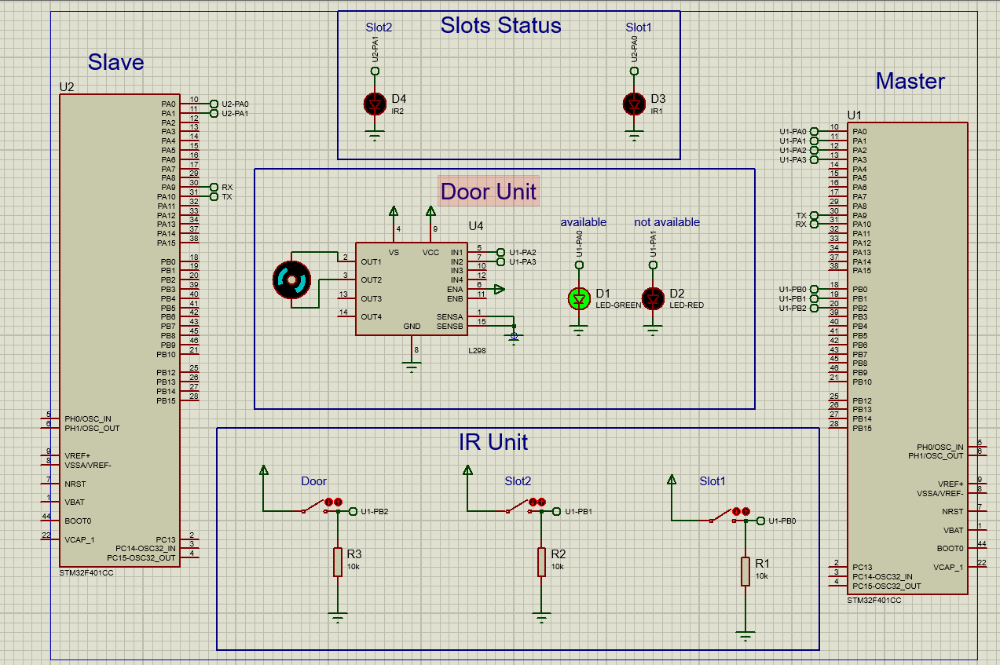

## Smart-Garage-System-ARM
* Smart Garage system using 2 ARM ECU to monitor garage slots and its door logic
* Project uses STM32F401cc microcontrollers

# ECUs
* Master ECU which is responsible to:
    * 				1- Monitor IR sensors at garage slots and Door
    * 				2- Control Door logic according to slots and door state.
    * 				3- send slots states to ECU2 (slave) to display it. 

* Slave ECU which is responsible to:display Slot status.

* Master and slave ECUs communicate via UART

# Drivers implemened for this project (implemented from scratch)
* RCC Driver (Clock Driver)
* NVIC Driver (Nested vector interrupt)
* GPIO Driver (General Purpose Input OUTPUT)
* EXTERNAL Interrupt Driver
* SYSTick Driver
* UART Driver

# System Functionality
 Master ECU is monitoring Slots states by IR sensor (Switch) and Door state (switch),
 ECU gets sensor input as an external interrupt to modify system state and sends the state to Slave ECU via UART.

# Used software tools:
* Eclipse IDE.
* Protues for  simulation.  

# Snap of Proteus results:

 